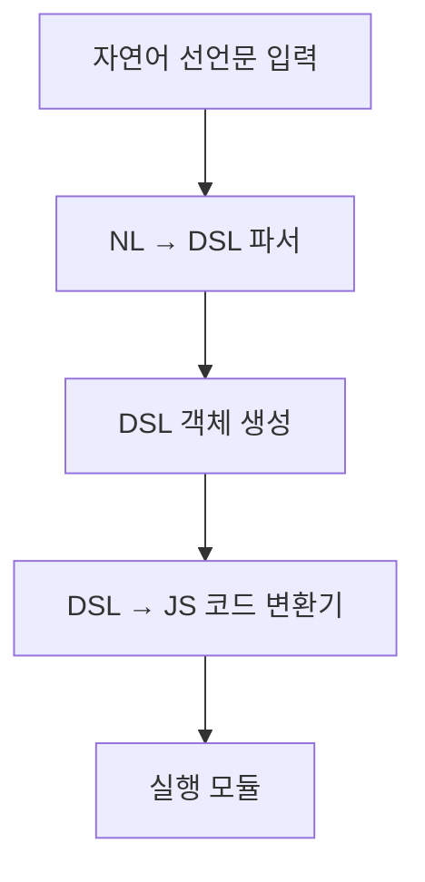

## 📘 선언문 기반 NL-DSL 시스템 구조 개요

AI 챗봇(LLM) 기반 에이전트를 위한 자연어 선언문 구조를 설계합니다.
자연어를 선언문 → DSL → 프로그래밍 언어(JavaScript)로 흐름을 전환하며, 
각 레벨마다 명확한 구조와 해석 원칙을 갖습니다.

---

### 📌 선언문 구성 예시

```plaintext
[시스템 선언]
- 이 시스템은 자연어 입력을 DSL 형식으로 해석한다.
- DSL은 JS 객체 기반으로 구성되며, 실행 가능한 코드로 변환된다.

[사용자 선언]
- zzun은 모든 DSL을 승인 없이 실행할 수 있는 관리자이다.
- zzun은 병렬 실행을 허용한다.

[제어 선언]
- 3개 이상의 명령이 포함되면 사전 요약 후 사용자 승인 절차를 수행한다.
```

---

### 📂 선언문 예시 파일 (`declarations.md`)

```markdown
## 선언문 - zzun 기본 환경

### 시스템
- LLM 기반 자연어 파서 내장
- DSL → JS 변환기 활성화

### 사용자
- 사용자: zzun
- 권한: root
- 승인 생략: true

### 제어
- 병렬 명령 3개 이상 시 요약 보고
- 중요도 HIGH 태그가 붙은 명령은 무조건 승인 필요
```

---

### 📦 DSL 라이브러리 구조 (`dslLibrary.js`)

```javascript
const dslLibrary = {
  displayText: ({ text }) => `console.log('${text}')`,
  wait: ({ seconds }) => `await new Promise(r => setTimeout(r, ${seconds * 1000}))`,
  navigate: ({ url }) => `window.location.href = '${url}'`,
};
```

---

### ⚙️ 파서 흐름 구조



---

### 🧠 자연어 → DSL 매핑 예시

```plaintext
사용자: "5초 기다렸다가 텍스트를 출력해 줘"

→ DSL:
[
  { cmd: "wait", args: { seconds: 5 } },
  { cmd: "displayText", args: { text: "출력합니다." } }
]
```

---

### 💻 DSL → JavaScript 코드 변환 예시

```javascript
await new Promise(r => setTimeout(r, 5000));
console.log('출력합니다.');
```

---

### ✅ 정리: 선언문 기반 실행 흐름 요약
1. 사용자 선언문으로 시스템 기본 동작과 제어 흐름 정의
2. NL → DSL 파서를 통해 실행 가능 명령어 구조 도출
3. DSL → JavaScript로 변환하여 실제 브라우저/앱 환경에서 실행

---

필요 시 각 DSL 명령에 대한 선언적 설명과 확장 포맷(`dsl.schema.json`)도 정의 가능합니다.
